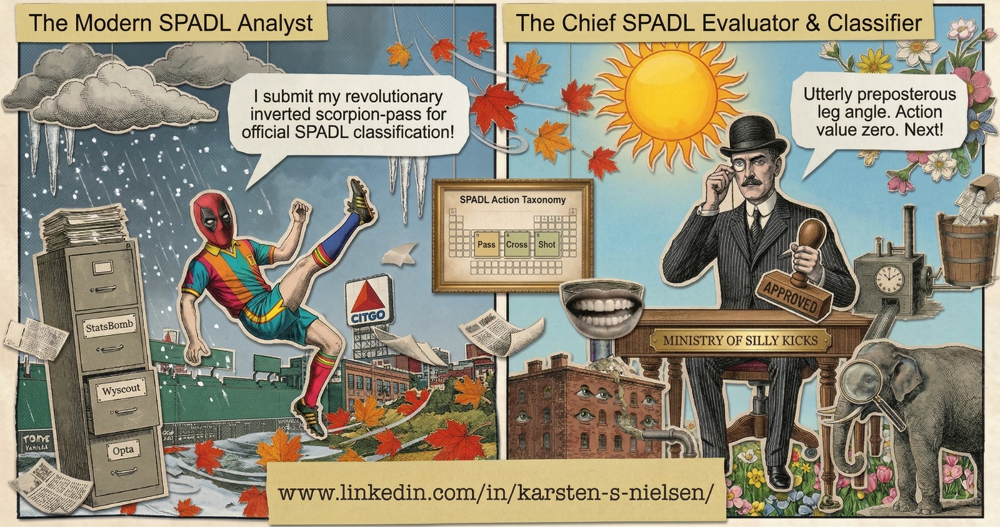

# silly-kicks


<sup>Comic by NanoBanana &mdash; inspired by Monty Python's <em>Ministry of Silly Walks</em></sup>

*The Ministry requires that all football actions be properly classified and valued.*

**silly-kicks** is a Python library for objectively quantifying the impact of
individual actions performed by football players using event stream data.

It is an independently maintained successor to
[socceraction](https://github.com/ML-KULeuven/socceraction), originally
developed by Tom Decroos and Pieter Robberechts at KU Leuven. Built under the
MIT license with full attribution preserved.

## Features

- **SPADL** -- Soccer Player Action Description Language: a unified schema for
  on-ball actions with converters for StatsBomb, Wyscout, Opta, and kloppy
- **VAEP** -- Valuing Actions by Estimating Probabilities: a framework for
  quantifying the value of individual actions
- **Atomic SPADL** -- continuous (non-discretized) action representation

## Installation

```bash
pip install silly-kicks
```

With optional provider support:

```bash
pip install "silly-kicks[statsbomb,kloppy,xgboost]"
```

## Quick Start

```python
import silly_kicks.spadl as spadl

# Convert StatsBomb events to SPADL actions
actions = spadl.statsbomb.convert_to_actions(events, home_team_id=123)

# Add human-readable names
actions = spadl.add_names(actions)
```

## Attribution

This project builds on the foundational research by the KU Leuven Machine
Learning Research Group. If you use this library in academic work, please cite
the original papers:

```bibtex
@inproceedings{Decroos2019VAEP,
  title     = {Actions Speak Louder than Goals: Valuing Player Actions in Soccer},
  author    = {Tom Decroos and Lotte Bransen and Jan Van Haaren and Jesse Davis},
  booktitle = {Proceedings of the 25th ACM SIGKDD International Conference
               on Knowledge Discovery \& Data Mining},
  pages     = {1851--1861},
  year      = {2019},
  doi       = {10.1145/3292500.3330758}
}

@inproceedings{Decroos2020AtomicSPADL,
  title     = {Interpretable Prediction of Goals in Soccer},
  author    = {Tom Decroos and Jesse Davis},
  booktitle = {Proceedings of the AAAI-20 Workshop on Artificial Intelligence
               in Team Sports},
  year      = {2020}
}
```

## License

MIT License. See [LICENSE](LICENSE) for details.
