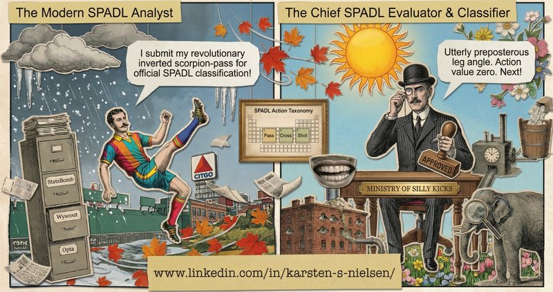

  

# (Ministry of) Silly Kicks

> Classify and value on-ball football actions using SPADL and VAEP.

Open-source Python library for soccer analytics &mdash; converts raw event and tracking data from multiple providers into a unified SPADL representation, then values every on-ball action using VAEP (Valuing Actions by Estimating Probabilities). The Hugging Face Hub hosts pre-trained model weights that ship with the library.

- **PyPI**: [`pip install silly-kicks`](https://pypi.org/project/silly-kicks/)
- **GitHub**: [karsten-s-nielsen/silly-kicks](https://github.com/karsten-s-nielsen/silly-kicks)
- **License**: [MIT](https://github.com/karsten-s-nielsen/silly-kicks/blob/main/LICENSE)

---

## Models

| Model | Architecture | Description |
|-------|-------------|-------------|
| [ghost-gk-v1](https://huggingface.co/silly-kicks/ghost-gk-v1) | RFCDE (HistGBR leaf co-occurrence + 2D KDE) | Conditional density estimation for league-average goalkeeper positioning. 26 goal-relative features, 60&times;64 probability grid output. Two variants: `"default"` (approx. 12 MB, bundled in wheel) and `"full"` (approx. 170 MB, downloaded from Hub). |

## What silly-kicks Does

**Event data converters** (`spadl/`): StatsBomb, Opta, Wyscout, Sportec, Metrica, Gradient Sports, SkillCorner, plus a Kloppy gateway. All return standardized SPADL DataFrames with guaranteed columns and dtypes.

**Tracking data** (`tracking/`): 20-column long-form schema with native adapters for Sportec, Gradient Sports, and Kloppy gateway (Metrica, SkillCorner). 30+ tracking-derived feature families including pitch control, pressure, defensive line geometry, off-ball runs, team shape, cover shadows, DAS, OBSO, PAUSA, and ghost-GK positioning.

**Action valuation** (`vaep/`): Binary classifiers (P(scores), P(concedes)) with XGBoost/CatBoost/LightGBM backends. Hybrid-VAEP removes result leakage. Tracking-aware features integrate seamlessly via composition.

## Academic Foundations

| Module | Foundation |
|--------|-----------|
| **SPADL + VAEP** | Decroos et al., "Actions Speak Louder than Goals" (2019) |
| **Pitch Control** | Spearman, "Physics-Based Modeling of Pass Probabilities" (2017) |
| **Ghost-GK** | Le et al. (2017, ghosting); Dutta et al. (2024, NFL RFCDE); Pospisil &amp; Lee (2018, RFCDE) |
| **Pressure** | Andrienko et al. (2017, oval zones); Bekkers (2024, &pi;-model) |
| **OBSO** | Spearman (2018, off-ball scoring opportunity) |
| **DAS** | Bischofberger &amp; Baca (2026, accessible space) |

## Links

- **Related project**: [(Right! Luxury!) Lakehouse](https://huggingface.co/luxury-lakehouse) &mdash; full soccer analytics platform built on Databricks, consuming silly-kicks as its core analytics engine
